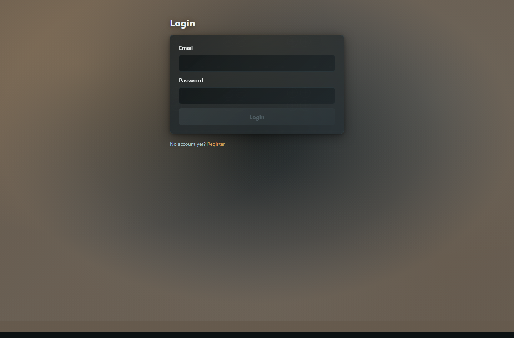
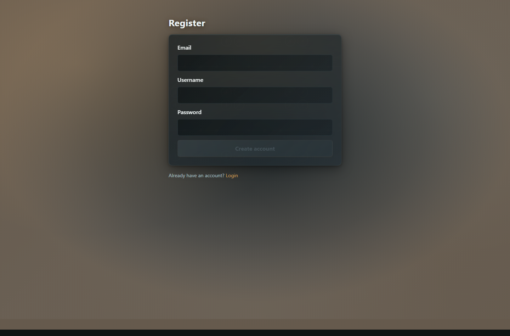
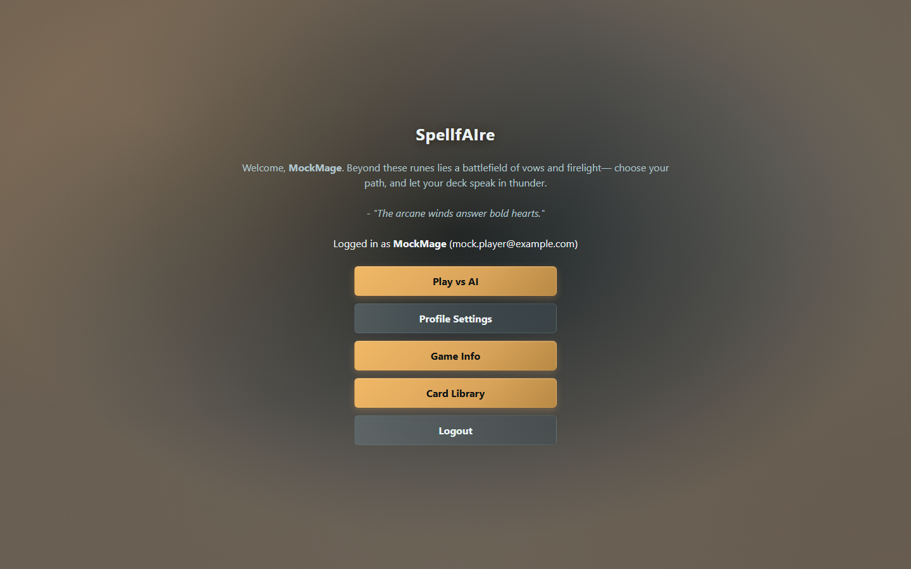
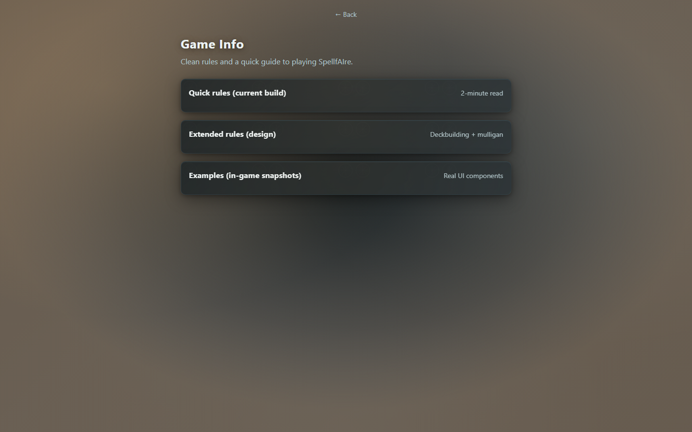
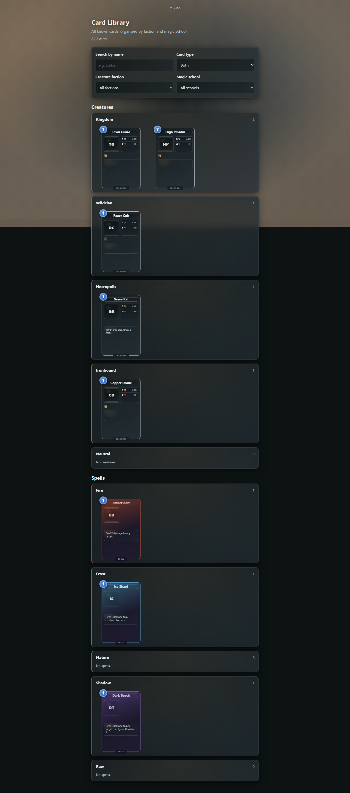
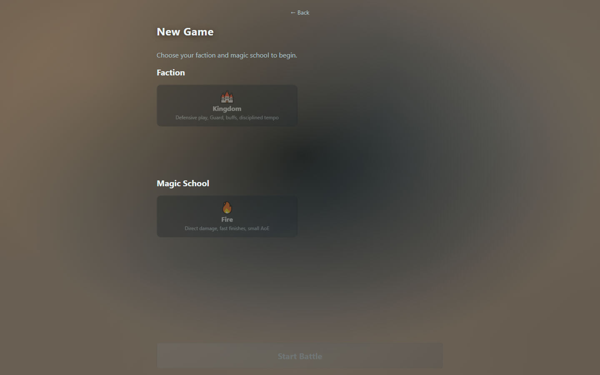
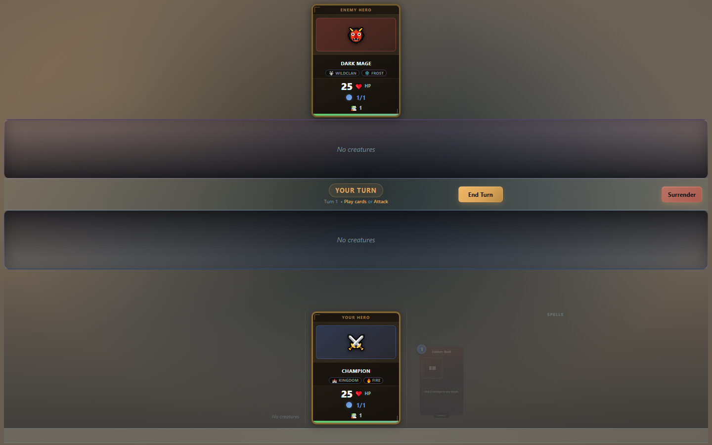

# SpellfAIre

SpellfAIre is a turn-based, web-friendly card battler (currently: **single-player vs AI**) inspired by collectible card games, aiming to be simpler and faster to iterate on.

This repo is a monorepo:
- `backend/`: Spring Boot (Spring Security) + MySQL
- `frontend/`: Angular SPA
- `infra/`: Local development infrastructure (MySQL + phpMyAdmin)

## Screenshots

> These images are generated from the Playwright mocked-api suite and committed under `docs/screenshots/`.

### Login


### Register


### Home


### Game Info


### Card Library


### New Game Setup


### Game Board


## Prereqs
- Java 21
- Maven 3.9+
- Node.js (latest LTS recommended) + npm
- Docker Desktop (for MySQL via compose and Testcontainers integration tests)

## Local development

### 1) Start MySQL
From repo root:

```bash
docker compose -f infra/docker-compose.yml up -d
```

MySQL will be available at `localhost:3307`.

### 2) Start backend

```bash
./backend/mvnw -f backend/pom.xml spring-boot:run
```

On Windows PowerShell:

```powershell
backend\mvnw.cmd -f backend\pom.xml spring-boot:run
```

Backend runs on `http://localhost:8080`.

### 3) Start frontend

```bash
cd frontend
npm install
npm start
```

Frontend runs on `http://localhost:4200`.

## Test runners

### Backend (JUnit 5 + Maven)

```bash
cd backend
./mvnw test
./mvnw verify
```

- `test` runs unit tests (`*Test`)
- `verify` runs unit + integration tests (`*IT`, Testcontainers)

### Frontend (Karma)

```bash
cd frontend
npm run test -- --watch=false --browsers=ChromeHeadless
```

### End-to-end (Playwright)

```bash
cd frontend
npm run e2e:mock
npm run e2e:real
```

- `e2e:mock` validates UI flows with mocked API endpoints.
- `e2e:real` validates full-stack flow against a running backend on `http://localhost:8080`.

### Documentation screenshots

Regenerate the committed README screenshots:

```powershell
npm run docs:screenshots
```

This runs the Playwright mocked-api suite that writes PNGs to `docs/screenshots/`.

### Root orchestrator scripts (Windows)

```powershell
npm run test:backend
npm run test:frontend
npm run test:e2e
npm run test:e2e:real
npm run test:e2e:all
npm run test:e2e:all:auto
npm run test:e2e:all:auto:reset
npm run test:e2e:down
npm run test:e2e:reset
npm run test:all
```

- `test:e2e:all` always runs mocked e2e first, then runs real e2e only if backend is reachable at `http://localhost:8080/api/auth/me`.
- `test:e2e:all:auto` runs mocked e2e, then auto-starts MySQL (`infra/docker-compose.yml`) and backend before running real e2e.
- `test:e2e:all:auto:reset` does the same as `test:e2e:all:auto`, but first recreates MySQL storage (`down -v`) for a clean database.
- `test:e2e:down` stops the MySQL container used by e2e autostart.
- `test:e2e:reset` recreates e2e MySQL from scratch (compose `down -v`, then `up -d mysql`).
- Override backend healthcheck URL with `SPELLFAIRE_BACKEND_URL` if needed.
